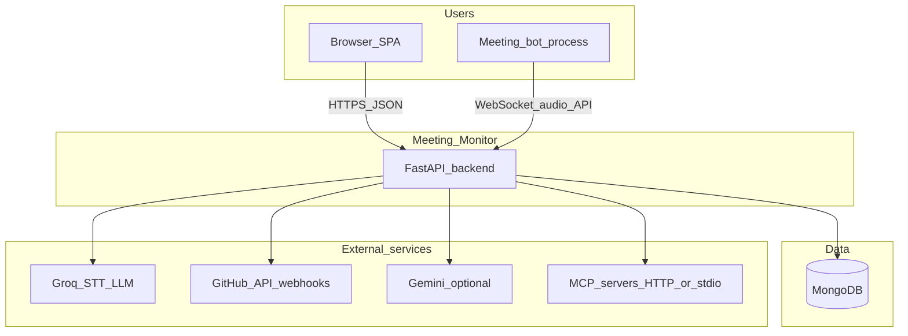
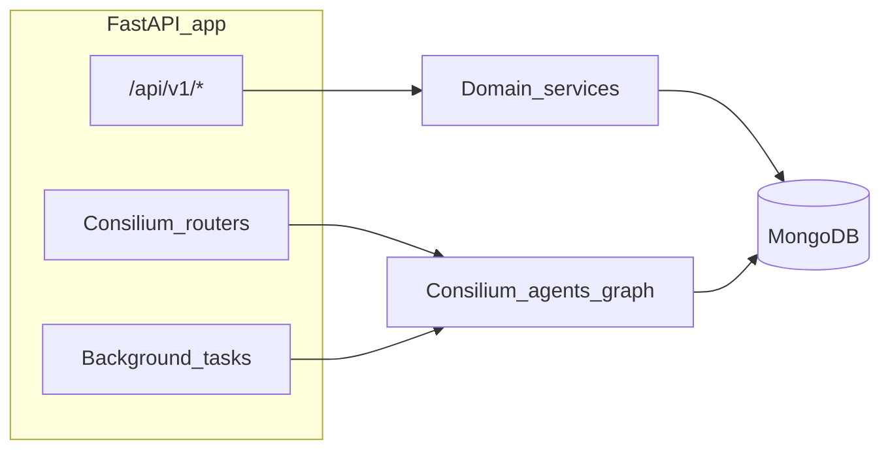
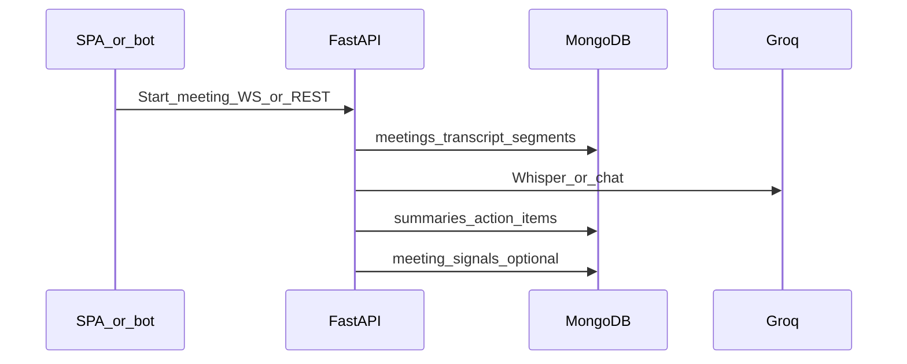

# Meeting Monitor — system architecture

This describes the **as-built** layout inferred from `backend/app/main.py`, `backend/app/api/v1/router.py`, and Consilium wiring under `backend/app/consilium/`.

## How to run (pointer)

- **Backend**: `pip install -r backend/requirements.txt`, configure `backend/.env` from `backend/.env.example`, then `cd backend` and `uvicorn app.main:app --reload` (or `python run.py`). See `backend/README.md`.
- **Frontend**: from repo root, `npm install` and `npm run dev` (Vite). Point the SPA at your API base URL (see app env / Vite proxy if used).

---

## 1. Context (who talks to whom)



---

## 2. Containers (major deployable parts)

| Container | Role | Tech |
|-----------|------|------|
| **Web UI** | Corporate/manager UI, Kanban, meetings, auth | Vite + React + TS (`package.json`), calls backend over HTTP |
| **Backend API** | Auth, projects, meetings, recordings, webhooks, Consilium workspaces | FastAPI (`backend/app/main.py`) |
| **MongoDB** | Users, projects, meetings, transcripts, workspaces, tasks, checkpoints | Motor async client (`backend/app/core/database.py`) |
| **Meeting bot** (optional) | Captures audio / drives live flow | Separate process; uses backend WS + REST (`backend/app/bot/`, `backend/app/api/v1/endpoints/meetings_bot.py`) |

---

## 3. Backend: two HTTP surfaces on one app

Same FastAPI process mounts **two router groups**:

1. **Versioned “product” API** — prefix `/api/v1` (`backend/app/api/v1/router.py`): auth, projects, tasks, recordings, meeting WebSockets, meetings CRUD/bot hooks, GitHub webhooks.
2. **Consilium / PMZero-style paths** — included at **root** from `backend/app/main.py`: `/api/workspaces`, requirements, GitHub connect for workspaces, notifications, etc. (`backend/app/consilium/routers/`).



**Background work** (startup in `backend/app/main.py`):

- **Consilium `monitoring_loop`** — periodic GitHub fetch + `run_graph_for_workspace` (`backend/app/consilium/agents/graph.py`) for linked workspaces.
- Optional **stale-task sweep** when configured.

---

## 4. Meeting stack (high level)



- **Live path**: WebSocket handlers under `/api/v1/ws` and meeting endpoints under `/api/v1/meetings`.
- **Post-meeting**: intelligence in `backend/app/services/meeting_intelligence.py` / orchestration in `backend/app/services/meetings_ops.py`; optional **Kanban rebuild** and **meeting_signals** for Consilium when `project_id` is present.

---

## 5. Consilium (workspace copilot) stack

```mermaid
flowchart TB
  subgraph graph [LangGraph_workspace_graph]
    PM[planning_merge]
    MM[monitoring_merge]
    RM[replan_merge]
    NT[notify]
    PM --> MM
    MM -->|replan| RM
    MM -->|notify_or_end| NT
    MM -->|end| END_NODE[END]
    RM -->|notify_or_end| NT
    RM -->|end| END_NODE
    NT --> END_NODE
  end

  subgraph persist [Persistence]
    WSdoc[workspaces_collection]
    CP[langgraph_checkpoints_optional]
  end

  graph --> WSdoc
  graph --> CP
```

- **State**: planning, GitHub monitoring, execution of `pending_actions`, risk, replanning, notifications — merged into four compiled nodes in `backend/app/consilium/agents/graph.py`.
- **Checkpointer**: Mongo (`MongoDBSaver`) or in-memory via env (`backend/app/consilium/agents/checkpointer.py`); `thread_id` = workspace id.
- **Enrichment**: latest **meeting signal** + optional **transcript RAG** prefetch before `invoke` (`backend/app/consilium/services/monitoring_prefetch.py`).
- **Tools**: MCP-style tool calls from execution path (`backend/app/consilium/agents/mcp_tools.py`) — HTTP by default, stdio optional.

---

## 6. Cross-cutting concerns

- **Config**: `backend/app/core/config.py` (Pydantic settings, `.env`).
- **Auth**: JWT for product API; Consilium auth router for workspace flows.
- **Transcript RAG**: FAISS + local embeddings for Kanban/Q&A/copilot paths (`backend/app/services/transcript_rag/`).

---

## Related docs

- `docs/meeting-bot.md`, `docs/meeting-stack-dod.md`, `docs/demo-script-meeting-stack.md`
- `backend/README.md` (API, Consilium checkpoints, MCP)
